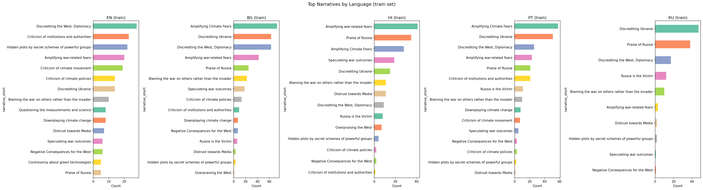
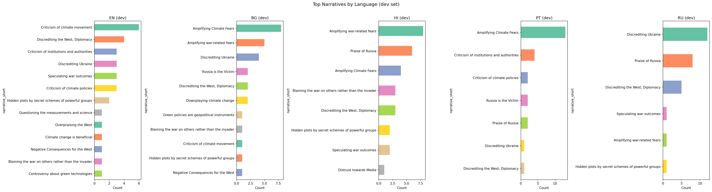
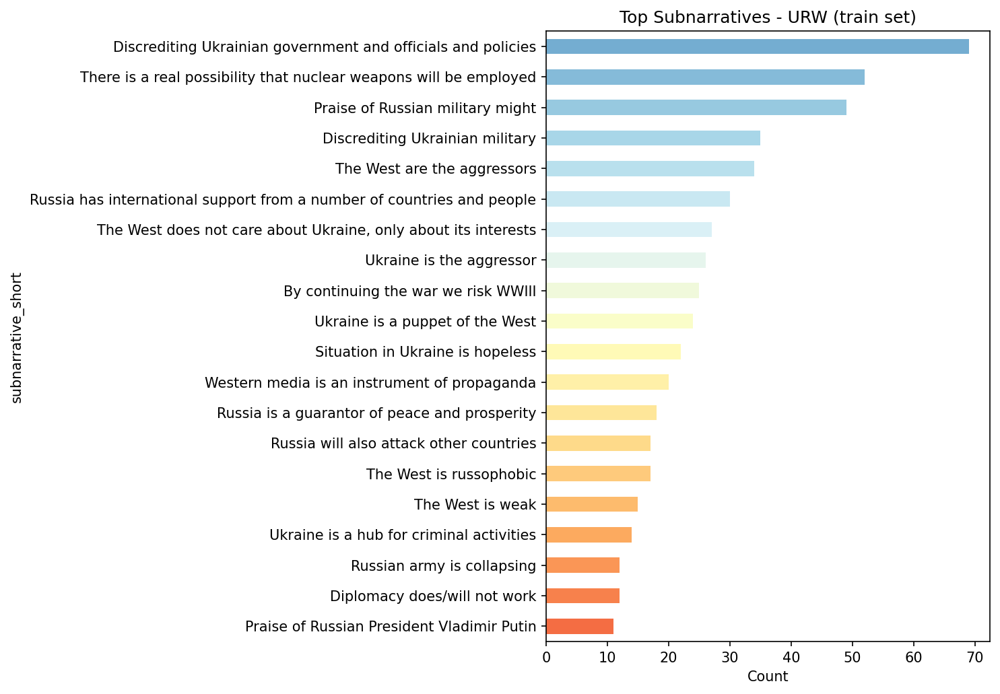
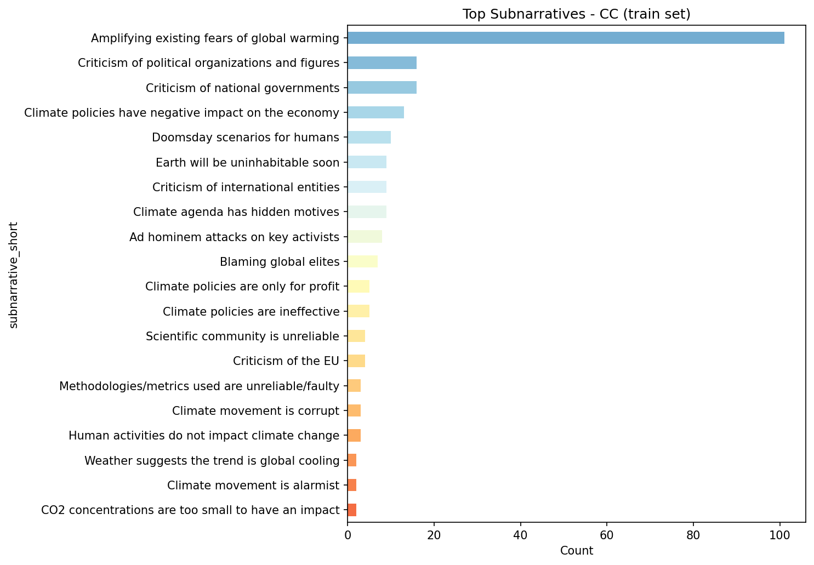
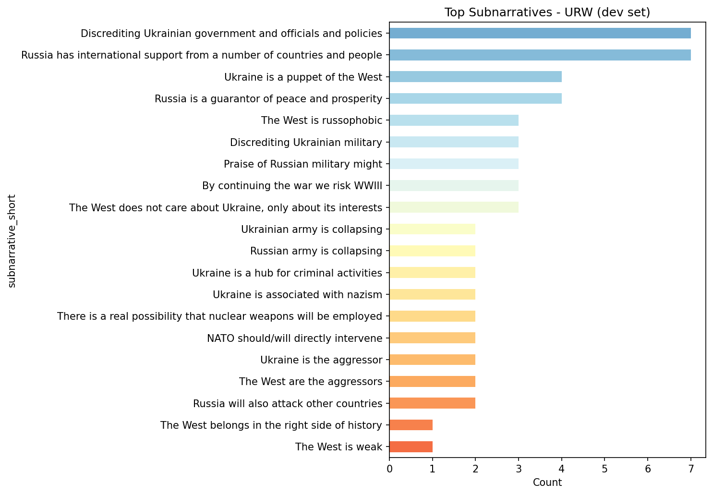
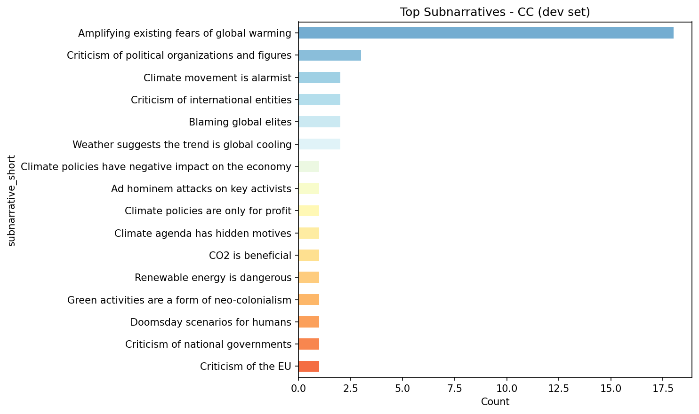
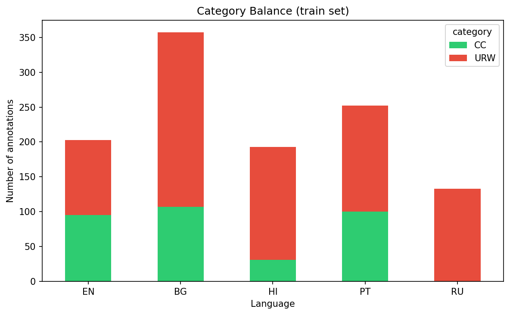
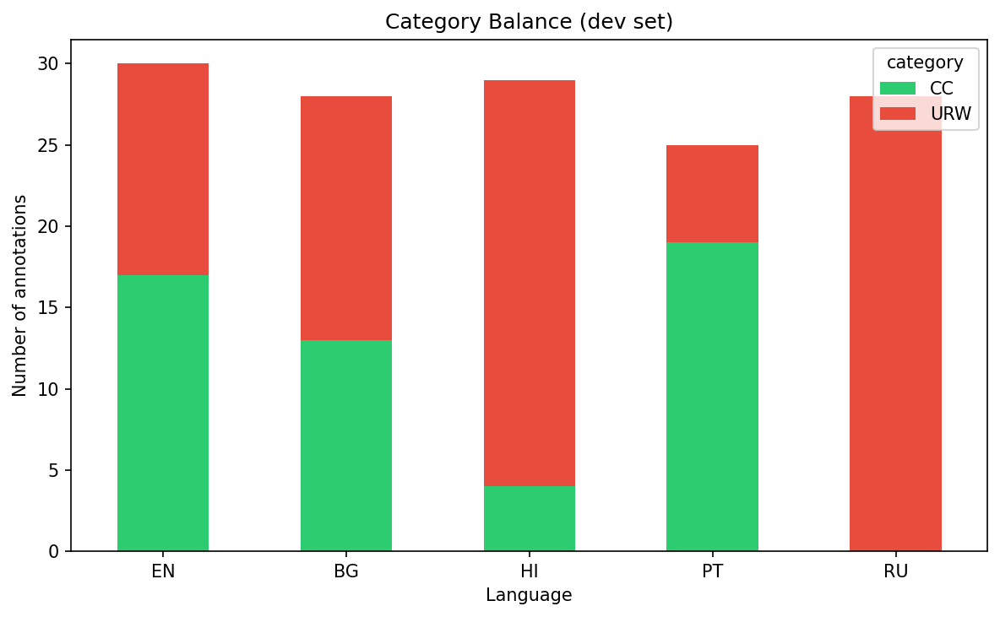
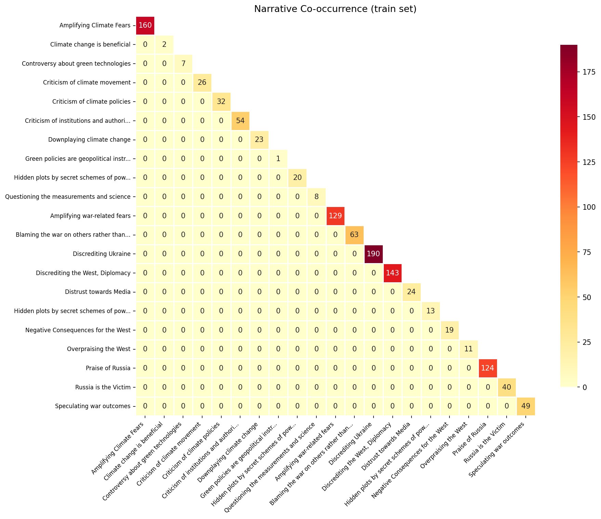

# Data Exploration Report: SemEval-2025 Task 10 - Propaganda Narrative Detection

This report provides an exploratory analysis of the training and development datasets
for the multilingual propaganda narrative classification task.

## 1. Taxonomy Overview

The label hierarchy has two levels: **narratives** and **subnarratives**,
organised under two domains.

### URW (11 narratives, 39 subnarratives)

**Blaming the war on others rather than the invader** - *Statements attributing responsibility or fault to entities other than Russia in the context of Russia’s invasion of Ukraine*

- Ukraine is the aggressor: Statements that shift the responsibility of the aggression to Ukraine instead of Russia and portray Ukraine as the attacker.
- The West are the aggressors: Statements that shift the responsibility for the conflict and escalation to the Western block.

**Discrediting Ukraine** - *Statements that undermine the legitimacy, actions, or intentions of Ukraine or Ukrainians as a nation.*

- Rewriting Ukraine’s history: Statements that aim to reestablish history of Ukrainian nation in a way that discredits its reputation.
- Discrediting Ukrainian nation and society: Statements that aggressively undermine the legitimacy and reputability of Ukrainian ethnicity and people
- Discrediting Ukrainian military: Statements that aim to undermine the capabilities, professionalism or effectiveness of the Ukrainian armed forces.
- Discrediting Ukrainian government and officials and policies: Statements that seek to delegitimize the Ukrainian government, its leaders, and its policies, portraying them as corrupt or incompetent.
- Ukraine is a puppet of the West: Claims that Ukraine is controlled or heavily influenced by Western powers, particularly the United States and European Union.
- Ukraine is a hub for criminal activities: Allegations that Ukraine is a center for illegal activities such as human trafficking, drug smuggling, or organized crime
- Ukraine is associated with nazism: Accusations that Ukrainian society or government has ties to or sympathies with Nazi ideology, often referencing historical events or extremist groups.
- Situation in Ukraine is hopeless: Statements that portray Ukraine as having no viable perspectives or no potential positive future.

**Russia is the Victim** - *Statements that portray Russia as being unfairly targeted or victimized.*

- The West is russophobic: Statements that claim that the negative reaction to Russia’s actions are because of the negative perspective of western countries instead of Russia’s own actions.
- Russia actions in Ukraine are only self-defence: Statements that justify Russia’s action solely as legitimate self-defence and not a deliberate action
- UA is anti-RU extremists: Statements claiming that Ukraine is comprised of extremist elements that are vehemently opposed to Russia.

**Praise of Russia** - *Statements that positively highlight Russia’s actions, policies, or character*

- Praise of Russian military might: Statements that positively highlight Russia’s military institutions, equipment and scale.
- Praise of Russian President Vladimir Putin: Statements that present Vladimir Putin positively, including his personal and leadership qualities.
- Russia is a guarantor of peace and prosperity: Statements that portray Russia solely in a positive manner, emphasising their potential to provide peace and prosperity to those that cooperate.
- Russia has international support from a number of countries and people: Statements that emphasise the popularity and acceptance of Russia in the international stage.
- Russian invasion has strong national support: Statements that emphasise the popularity and acceptance of the invasion inside Russia and on Russian-speaking populations.

**Overpraising the West** - *Statements that excessively and unduly laud or extol the virtues, accomplishments, and moral superiority of Western countries, particularly in the context of international relations and military.*

- NATO will destroy Russia: Statements that suggest or claim that the North Atlantic Treaty Organization (NATO) and its allies are capable or already in the process of eradicating Russia.
- The West belongs in the right side of history: Statements that portray Western nations and their actions as morally superior and aligned with progress and justice and possess moral superiority.
- The West has the strongest international support: Statements that emphasize or claim widespread backing for Western policies and actions from the international community, potentially downplaying opposition or criticism.

**Speculating war outcomes** - *Statements that predict or make assumptions about the potential results or consequences of a conflict*

- Russian army is collapsing: Statements that suggest or claim that the Russian military is experiencing a significant decline in its effectiveness, strength, or morale.
- Russian army will lose all the occupied territories: Speculative statements that predict or assume the potential outcomes of the conflict, specifically regarding the possibility of the Russian military losing control of all the territories it currently occupies.
- Ukrainian army is collapsing: Statements that suggest or claim that the Ukrainian military is experiencing a significant decline in its effectiveness, strength, or morale.

**Discrediting the West, Diplomacy** - *Statements that criticize the Western countries, or international diplomatic efforts.*

- The EU is divided: Statements that present the EU as a set of divided entities and interests, usually unable to take actions.
- The West is weak: Statements presenting the West overall as a non-potent group of countries (that is not as powerful as it used to be).
- The West is overreacting: Statements that claim that the West and its institutions are reacting to Russia’s actions in a disproportionate manner.
- The West does not care about Ukraine, only about its interests: Statements that claim that the West is only interested in Ukraine for its own benefits, disregarding the country’s fate.
- Diplomacy does/will not work: Statements discrediting the potential of ongoing or potential diplomatic efforts.
- West is tired of Ukraine: Claims that Western countries, particularly the United States and European nations, are becoming fatigued or disinterested in supporting Ukraine and its efforts.

**Negative Consequences for the West** - *Statements that highlight or predict adverse outcomes for Western countries and their interests.*

- Sanctions imposed by Western countries will backfire: Statements that catastrophize on the possible negative effects for Western sanctions of Russia.
- The conflict will increase the Ukrainian refugee flows to Europe: Statements that catastrophize on the possible refugee outflows due to the conflict.

**Distrust towards Media** - *Statements that question the reliability or integrity of media organizations.*

- Western media is an instrument of propaganda: Statements that discredit the media institutions of the West and claim that they are instruments of propaganda.
- Ukrainian media cannot be trusted: Statements that discredit the media institutions of the Ukraine and claim that they should not be trusted for reporting on the war.

**Amplifying war-related fears** - *Statements that evoke fear or anxiety about potential threats, dangers or reactions.*

- By continuing the war we risk WWIII: Statements that warn against upsetting Russia’s and its leadership, evoking fear of causing WW3.
- Russia will also attack other countries: Statements that claim that it is imminent that Russia will attack other countries.
- There is a real possibility that nuclear weapons will be employed: Statements that evoke fear or anxiety about the use of nuclear weapons.
- NATO should/will directly intervene: Statements that suggest or claim that the North Atlantic Treaty Organization (NATO) ought to or will take direct military action in a conflict, potentially implying a shift in policy or strategy.

**Hidden plots by secret schemes of powerful groups** - *Statements that propose secret plots or hidden agendas related to climate change initiated by powerful entities or groups.*

- Other

### CC (10 narratives, 36 subnarratives)

**Criticism of climate policies** - *Statements that question the effectiveness, economic impact, or motives behind climate policies.*

- Climate policies are ineffective: Statements suggesting that climate policies fail to achieve their intended environmental goals.
- Climate policies have negative impact on the economy: Statements claiming that climate policies lead to negative economic outcomes.
- Climate policies are only for profit: Statements that argue climate policies are driven by financial or corporate gain rather than genuine environmental concerns.

**Criticism of institutions and authorities** - *Statements that challenge the competence, integrity, or intentions of various institutions and authorities in relation to climate change*

- Criticism of the EU: Statements that express disapproval or distrust of the EU’s role or approach to climate change or the EU in general.
- Criticism of international entities: Statements that criticize the role and influence of international entities on climate policy.
- Criticism of national governments: Statements that disapprove of the ways national governments handle climate change
- Criticism of political organizations and figures: Statements that discredit political organizations and figures in the context of climate change debate.

**Climate change is beneficial** - *Statements that present arguments that support that changes in climate can have positive effects as well.*

- CO2 is beneficial: Statements suggesting that increased CO2 levels have positive impacts on the environment.
- Temperature increase is beneficial: Statements claiming that rising global temperatures can have positive effects.

**Downplaying climate change** - *Statements that minimize the significance or impact of climate change.*

- Climate cycles are natural: Statements suggesting that climate change is a natural and cyclical occurrence.
- Weather suggests the trend is global cooling: Statements using local or short-term weather patterns to argue against global warming.
- Temperature increase does not have significant impact: Statements claiming that the increase in temperature is not going to have any noticeable effect in nature.
- CO2 concentrations are too small to have an impact: Statements claiming that the concentrations of CO2 will have a negligible effect.
- Human activities do not impact climate change: Statements that support that climate change is not caused by human activity.
- Ice is not melting: Statements claiming that there is not melting of ice.
- Sea levels are not rising: Statements denying that sea levels have risen (or will rise).
- Humans and nature will adapt to the changes: Statements claiming that whatever the changes in climate humans or nature will manage to find solutions to adapt.

**Questioning the measurements and science** - *Statements that raise doubts about the scientific methods, data, and consensus on climate change.*

- Methodologies/metrics used are unreliable/faulty: Statements claiming that the scientific methodologies and metrics used to measure climate change are flawed or unreliable.
- Data shows no temperature increase: Statements asserting that available data does not support the claim of global temperature increase.
- Greenhouse effect/carbon dioxide do not drive climate change: Statements asserting that available data does not support the claim of global temperature increase.
- Scientific community is unreliable: Statements discrediting scientists, the scientific community and their actions.

**Criticism of climate movement** - *Statements that challenge the motives, integrity, or impact of the climate movement.*

- Climate movement is alarmist: Statements suggesting that the climate movement exaggerates the severity of climate change for dramatic effect.
- Climate movement is corrupt: Statements alleging that the climate movement is influenced by ulterior motives, by corruption or by unethical practices.
- Ad hominem attacks on key activists: Statements attacking the reputation of key figures (such as scientists, activists, politicians or public figures).

**Controversy about green technologies** - *Statements that express skepticism or criticism of environmentally friendly technologies.*

- Renewable energy is dangerous: Statements claiming that renewable energy sources pose significant risks or dangers.
- Renewable energy is unreliable: Statements asserting that renewable energy sources are not dependable for widespread adoption.
- Renewable energy is costly: Statements asserting that renewable energy sources are too expensive, inefficient and worth adopting for widespread use.
- Nuclear energy is not climate friendly: Statements asserting that nuclear sources are or should not be considered as good for the climate.

**Hidden plots by secret schemes of powerful groups**

- Blaming global elites: Statements attributing climate change agendas to secretive and powerful global elites.
- Climate agenda has hidden motives: Claims that the push for climate action is driven by ulterior motives, such as political power or population control

**Amplifying Climate Fears** - *Statements that emphasize and amplify fears about the consequences of climate change.*

- Earth will be uninhabitable soon: Statements predicting that the Earth will become uninhabitable in the near future due to climate change.
- Amplifying existing fears of global warming: Statements that are using fears related to warming of the earths surface and atmosphere and speculating on side effects to spread panic.
- Doomsday scenarios for humans: Statements presenting intense catastrophic scenarios as results of climate change.
- Whatever we do it is already too late: Statements that minimize the urgency of addressing climate change by suggesting that any action taken at this point is futile or too late to make a meaningful impact.

**Green policies are geopolitical instruments** - *Statements claimin that that environmental policies and initiatives are used as tools for geopolitical power and influence rather than genuine environmental concern.*

- Climate-related international relations are abusive/exploitative: Statements criticizing international relations related to climate change as exploitative or economically abusive.
- Green activities are a form of neo-colonialism: Statements suggesting that green initiatives are a way for developed countries to exert control and influence over developing nations, a modern form of colonial practices.

## 2. Dataset Summary

### Train Set

| Language | Documents | Annotations | URW | CC | Other | Subnarrative=none |
|----------|-----------|-------------|-----|-----|-------|-------------------|
| EN | 203 | 203 | 108 | 95 | 0 | 58 (29%) |
| BG | 357 | 357 | 250 | 107 | 0 | 54 (15%) |
| HI | 193 | 193 | 162 | 31 | 0 | 46 (24%) |
| PT | 252 | 252 | 152 | 100 | 0 | 121 (48%) |
| RU | 133 | 133 | 133 | 0 | 0 | 15 (11%) |

### Dev Set

| Language | Documents | Annotations | URW | CC | Other | Subnarrative=none |
|----------|-----------|-------------|-----|-----|-------|-------------------|
| EN | 30 | 30 | 13 | 17 | 0 | 6 (20%) |
| BG | 28 | 28 | 15 | 13 | 0 | 8 (29%) |
| HI | 29 | 29 | 25 | 4 | 0 | 10 (34%) |
| PT | 25 | 25 | 6 | 19 | 0 | 8 (32%) |
| RU | 28 | 28 | 28 | 0 | 0 | 5 (18%) |

## 3. Narrative Frequency Distributions

### Train Set

**Top 15 narratives (train):**

| Rank | Narrative | Count | % |
|------|-----------|-------|---|
| 1 | URW: Discrediting Ukraine | 190 | 16.7% |
| 2 | CC: Amplifying Climate Fears | 160 | 14.1% |
| 3 | URW: Discrediting the West, Diplomacy | 143 | 12.6% |
| 4 | URW: Amplifying war-related fears | 129 | 11.3% |
| 5 | URW: Praise of Russia | 124 | 10.9% |
| 6 | URW: Blaming the war on others rather than the invader | 63 | 5.5% |
| 7 | CC: Criticism of institutions and authorities | 54 | 4.7% |
| 8 | URW: Speculating war outcomes | 49 | 4.3% |
| 9 | URW: Russia is the Victim | 40 | 3.5% |
| 10 | CC: Criticism of climate policies | 32 | 2.8% |
| 11 | CC: Criticism of climate movement | 26 | 2.3% |
| 12 | URW: Distrust towards Media | 24 | 2.1% |
| 13 | CC: Downplaying climate change | 23 | 2.0% |
| 14 | CC: Hidden plots by secret schemes of powerful groups | 20 | 1.8% |
| 15 | URW: Negative Consequences for the West | 19 | 1.7% |

### Dev Set

**Top 15 narratives (dev):**

| Rank | Narrative | Count | % |
|------|-----------|-------|---|
| 1 | CC: Amplifying Climate Fears | 25 | 17.9% |
| 2 | URW: Discrediting Ukraine | 20 | 14.3% |
| 3 | URW: Praise of Russia | 16 | 11.4% |
| 4 | URW: Discrediting the West, Diplomacy | 15 | 10.7% |
| 5 | URW: Amplifying war-related fears | 14 | 10.0% |
| 6 | CC: Criticism of institutions and authorities | 7 | 5.0% |
| 7 | CC: Criticism of climate movement | 7 | 5.0% |
| 8 | URW: Speculating war outcomes | 6 | 4.3% |
| 9 | CC: Criticism of climate policies | 5 | 3.6% |
| 10 | URW: Blaming the war on others rather than the invader | 5 | 3.6% |
| 11 | URW: Russia is the Victim | 4 | 2.9% |
| 12 | URW: Hidden plots by secret schemes of powerful groups | 3 | 2.1% |
| 13 | CC: Hidden plots by secret schemes of powerful groups | 3 | 2.1% |
| 14 | URW: Negative Consequences for the West | 2 | 1.4% |
| 15 | CC: Downplaying climate change | 2 | 1.4% |

## 4. Subnarrative Frequency Distributions

### Train Set

**Top 15 URW subnarratives (train):**

| Rank | Subnarrative | Count |
|------|--------------|-------|
| 1 | URW: Discrediting Ukraine: Discrediting Ukrainian government and officials and policies | 69 |
| 2 | URW: Amplifying war-related fears: There is a real possibility that nuclear weapons will be employed | 52 |
| 3 | URW: Praise of Russia: Praise of Russian military might | 49 |
| 4 | URW: Discrediting Ukraine: Discrediting Ukrainian military | 35 |
| 5 | URW: Blaming the war on others rather than the invader: The West are the aggressors | 34 |
| 6 | URW: Praise of Russia: Russia has international support from a number of countries and people | 30 |
| 7 | URW: Discrediting the West, Diplomacy: The West does not care about Ukraine, only about its interests | 27 |
| 8 | URW: Blaming the war on others rather than the invader: Ukraine is the aggressor | 26 |
| 9 | URW: Amplifying war-related fears: By continuing the war we risk WWIII | 25 |
| 10 | URW: Discrediting Ukraine: Ukraine is a puppet of the West | 24 |
| 11 | URW: Discrediting Ukraine: Situation in Ukraine is hopeless | 22 |
| 12 | URW: Distrust towards Media: Western media is an instrument of propaganda | 20 |
| 13 | URW: Praise of Russia: Russia is a guarantor of peace and prosperity | 18 |
| 14 | URW: Amplifying war-related fears: Russia will also attack other countries | 17 |
| 15 | URW: Russia is the Victim: The West is russophobic | 17 |

**Top 15 CC subnarratives (train):**

| Rank | Subnarrative | Count |
|------|--------------|-------|
| 1 | CC: Amplifying Climate Fears: Amplifying existing fears of global warming | 101 |
| 2 | CC: Criticism of institutions and authorities: Criticism of political organizations and figures | 16 |
| 3 | CC: Criticism of institutions and authorities: Criticism of national governments | 16 |
| 4 | CC: Criticism of climate policies: Climate policies have negative impact on the economy | 13 |
| 5 | CC: Amplifying Climate Fears: Doomsday scenarios for humans | 10 |
| 6 | CC: Amplifying Climate Fears: Earth will be uninhabitable soon | 9 |
| 7 | CC: Criticism of institutions and authorities: Criticism of international entities | 9 |
| 8 | CC: Hidden plots by secret schemes of powerful groups: Climate agenda has hidden motives | 9 |
| 9 | CC: Criticism of climate movement: Ad hominem attacks on key activists | 8 |
| 10 | CC: Hidden plots by secret schemes of powerful groups: Blaming global elites | 7 |
| 11 | CC: Criticism of climate policies: Climate policies are only for profit | 5 |
| 12 | CC: Criticism of climate policies: Climate policies are ineffective | 5 |
| 13 | CC: Questioning the measurements and science: Scientific community is unreliable | 4 |
| 14 | CC: Criticism of institutions and authorities: Criticism of the EU | 4 |
| 15 | CC: Questioning the measurements and science: Methodologies/metrics used are unreliable/faulty | 3 |

### Dev Set

**Top 15 URW subnarratives (dev):**

| Rank | Subnarrative | Count |
|------|--------------|-------|
| 1 | URW: Discrediting Ukraine: Discrediting Ukrainian government and officials and policies | 7 |
| 2 | URW: Praise of Russia: Russia has international support from a number of countries and people | 7 |
| 3 | URW: Discrediting Ukraine: Ukraine is a puppet of the West | 4 |
| 4 | URW: Praise of Russia: Russia is a guarantor of peace and prosperity | 4 |
| 5 | URW: Russia is the Victim: The West is russophobic | 3 |
| 6 | URW: Discrediting Ukraine: Discrediting Ukrainian military | 3 |
| 7 | URW: Praise of Russia: Praise of Russian military might | 3 |
| 8 | URW: Amplifying war-related fears: By continuing the war we risk WWIII | 3 |
| 9 | URW: Discrediting the West, Diplomacy: The West does not care about Ukraine, only about its interests | 3 |
| 10 | URW: Speculating war outcomes: Ukrainian army is collapsing | 2 |
| 11 | URW: Speculating war outcomes: Russian army is collapsing | 2 |
| 12 | URW: Discrediting Ukraine: Ukraine is a hub for criminal activities | 2 |
| 13 | URW: Discrediting Ukraine: Ukraine is associated with nazism | 2 |
| 14 | URW: Amplifying war-related fears: There is a real possibility that nuclear weapons will be employed | 2 |
| 15 | URW: Amplifying war-related fears: NATO should/will directly intervene | 2 |

**Top 15 CC subnarratives (dev):**

| Rank | Subnarrative | Count |
|------|--------------|-------|
| 1 | CC: Amplifying Climate Fears: Amplifying existing fears of global warming | 18 |
| 2 | CC: Criticism of institutions and authorities: Criticism of political organizations and figures | 3 |
| 3 | CC: Criticism of climate movement: Climate movement is alarmist | 2 |
| 4 | CC: Criticism of institutions and authorities: Criticism of international entities | 2 |
| 5 | CC: Hidden plots by secret schemes of powerful groups: Blaming global elites | 2 |
| 6 | CC: Downplaying climate change: Weather suggests the trend is global cooling | 2 |
| 7 | CC: Criticism of climate policies: Climate policies have negative impact on the economy | 1 |
| 8 | CC: Criticism of climate movement: Ad hominem attacks on key activists | 1 |
| 9 | CC: Criticism of climate policies: Climate policies are only for profit | 1 |
| 10 | CC: Hidden plots by secret schemes of powerful groups: Climate agenda has hidden motives | 1 |
| 11 | CC: Climate change is beneficial: CO2 is beneficial | 1 |
| 12 | CC: Controversy about green technologies: Renewable energy is dangerous | 1 |
| 13 | CC: Green policies are geopolitical instruments: Green activities are a form of neo-colonialism | 1 |
| 14 | CC: Amplifying Climate Fears: Doomsday scenarios for humans | 1 |
| 15 | CC: Criticism of institutions and authorities: Criticism of national governments | 1 |

## 5. Category Balance (URW vs CC)

## 6. Narrative Co-occurrence Analysis

Co-occurrence measures how often two narratives are annotated for the same document.
High co-occurrence between narratives suggests thematic overlap.

### Top Co-occurring Narrative Pairs (train set)

| Narrative A | Narrative B | Co-occurrences |
|-------------|-------------|----------------|

## 7. Labels per Document

### Train Set

| Language | Mean narratives/doc | Max narratives/doc | Mean subnarratives/doc | Max subnarratives/doc |
|----------|--------------------:|-------------------:|-----------------------:|----------------------:|
| EN | 1.00 | 1 | 0.71 | 1 |
| BG | 1.00 | 1 | 0.85 | 1 |
| HI | 1.00 | 1 | 0.76 | 1 |
| PT | 1.00 | 1 | 0.52 | 1 |
| RU | 1.00 | 1 | 0.89 | 1 |

### Dev Set

| Language | Mean narratives/doc | Max narratives/doc | Mean subnarratives/doc | Max subnarratives/doc |
|----------|--------------------:|-------------------:|-----------------------:|----------------------:|
| EN | 1.00 | 1 | 0.80 | 1 |
| BG | 1.00 | 1 | 0.71 | 1 |
| HI | 1.00 | 1 | 0.66 | 1 |
| PT | 1.00 | 1 | 0.68 | 1 |
| RU | 1.00 | 1 | 0.82 | 1 |

## 8. Cross-Language Comparison

Narrative distributions may vary across languages due to differing media landscapes.

**Narrative distribution (% of annotations per language, train set):**

| Narrative | EN | BG | HI | PT | RU |
|-----------|------:|------:|------:|------:|------:|
| Amplifying Climate Fears | 0.5% | 20.4% | 14.5% | 23.0% | 0.0% |
| Amplifying war-related fears | 9.9% | 11.8% | 21.2% | 9.1% | 2.3% |
| Blaming the war on others rather than the invader | 4.9% | 6.2% | 5.7% | 4.0% | 7.5% |
| Climate change is beneficial | 0.0% | 0.3% | 0.0% | 0.4% | 0.0% |
| Controversy about green technologies | 2.5% | 0.3% | 0.0% | 0.4% | 0.0% |
| Criticism of climate movement | 9.4% | 0.0% | 0.0% | 2.8% | 0.0% |
| Criticism of climate policies | 6.9% | 3.6% | 1.0% | 1.2% | 0.0% |
| Criticism of institutions and authorities | 11.3% | 2.5% | 0.5% | 8.3% | 0.0% |
| Discrediting Ukraine | 6.9% | 17.6% | 7.8% | 20.2% | 35.3% |
| Discrediting the West, Diplomacy | 13.8% | 17.6% | 4.7% | 10.3% | 12.8% |
| Distrust towards Media | 3.4% | 0.8% | 5.7% | 0.4% | 1.5% |
| Downplaying climate change | 3.9% | 2.0% | 0.0% | 3.2% | 0.0% |
| Green policies are geopolitical instruments | 0.5% | 0.0% | 0.0% | 0.0% | 0.0% |
| Hidden plots by secret schemes of powerful groups | 10.8% | 0.8% | 2.1% | 0.8% | 1.5% |
| Negative Consequences for the West | 3.0% | 2.0% | 1.0% | 1.2% | 0.8% |
| Overpraising the West | 1.5% | 0.3% | 3.6% | 0.0% | 0.0% |
| Praise of Russia | 2.5% | 7.0% | 18.1% | 8.3% | 28.6% |
| Questioning the measurements and science | 3.9% | 0.0% | 0.0% | 0.0% | 0.0% |
| Russia is the Victim | 1.5% | 1.7% | 4.1% | 4.4% | 9.0% |
| Speculating war outcomes | 3.0% | 5.0% | 9.8% | 2.0% | 0.8% |
